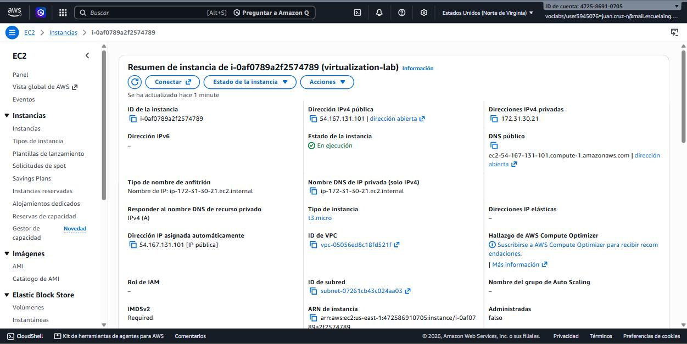
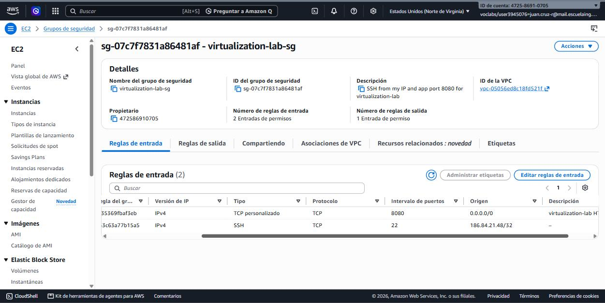
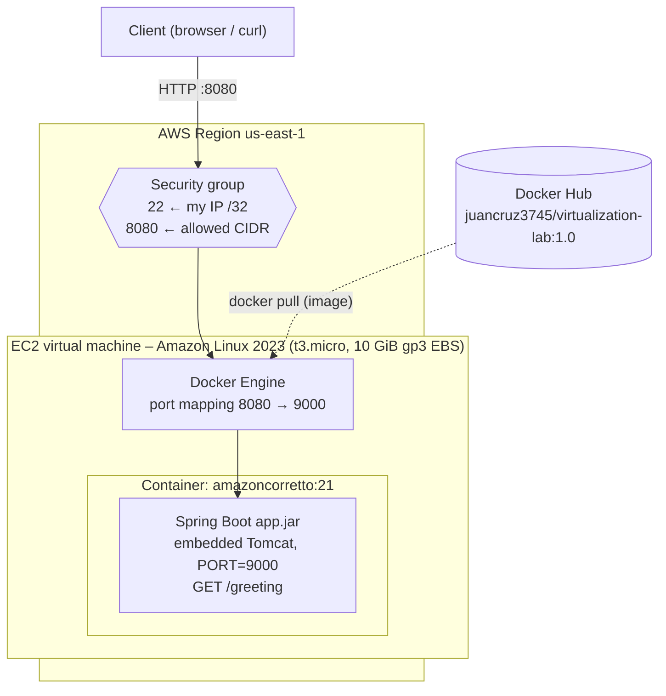
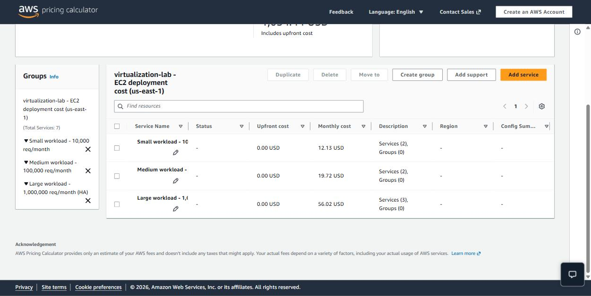
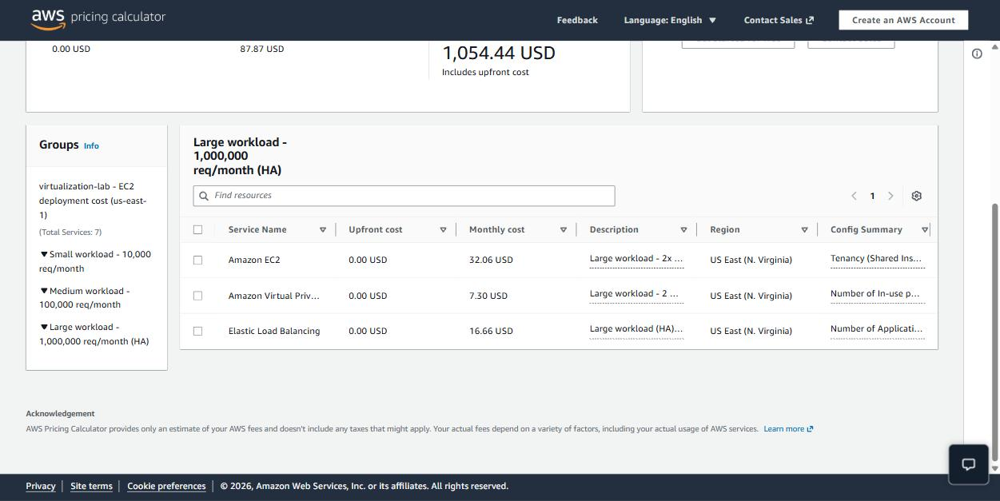

# Containerizing and Deploying a Java Web Application

Workshop on virtualization as an architectural mechanism for modularity, isolation, portability and deployment. A minimal Spring Boot web service is packaged as a Docker image, run as several isolated containers, composed with MongoDB, published to Docker Hub and deployed on an Amazon EC2 virtual machine. The deployment model and its cost are analyzed for three workload levels.

| Item | Value |
|---|---|
| Docker Hub repository | [hub.docker.com/r/juancruz3745/virtualization-lab](https://hub.docker.com/r/juancruz3745/virtualization-lab) |
| Public deployment URL | http://ec2-54-167-131-101.compute-1.amazonaws.com:8080/greeting?name=AWS |
| Demo video | `<video-link>` <!-- TODO --> |

## Technology baseline

| Component | Version |
|---|---|
| Java | 21 LTS (local: Oracle JDK 21.0.9; container: Amazon Corretto 21) |
| Build | Maven 3.9.12 (via Maven Wrapper `mvnw`) |
| Framework | Spring Boot 4.1.1 (embedded Tomcat 11) |
| Containers | Docker Engine 29.3.1, Docker Compose v5.1.1 |
| Database (Compose only) | `mongo:8` |
| Cloud | Amazon Linux 2023 on AWS EC2 |

## Project structure

```
.
├── pom.xml                         # Spring Boot 4.1.1 parent, Java 21
├── mvnw, mvnw.cmd, .mvn/wrapper/   # Maven Wrapper (no local Maven needed)
├── src/main/java/co/edu/escuelaing/virtualizationlab/
│   ├── RestServiceApplication.java # Entry point, reads PORT (default 9000)
│   └── HelloRestController.java    # GET /greeting?name=...
├── Dockerfile                      # amazoncorretto:21 + executable jar
├── .dockerignore
├── compose.yaml                    # web + mongo:8, named volumes
└── evidence/                       # Command outputs and screenshots
```

## Part 1 – Web application

`HelloRestController` exposes `GET /greeting?name=<name>` and returns `Hello, <name>!` (`World` by default).

`RestServiceApplication` obtains the listening port from the `PORT` environment variable, falling back to **9000**. It sets it as a *default* property, so `--server.port` or `SERVER_PORT` can still override it:

```java
application.setDefaultProperties(
        Map.of("server.port",
                System.getenv().getOrDefault("PORT", "9000")));
```

> The workshop text mentions 6000 as default port but its code and Dockerfile use 9000. This project uses 9000 consistently. Note that port 6000 (X11) is blocked by Chrome and Firefox (`ERR_UNSAFE_PORT`), so it cannot be tested from a browser anyway.

### Build and run

```bash
./mvnw clean package                 # Windows: mvnw.cmd clean package
java -jar target/virtualization-lab-1.0.0.jar
```

```bash
curl "http://localhost:9000/greeting?name=Pedro"
# Hello, Pedro!

PORT=9100 java -jar target/virtualization-lab-1.0.0.jar   # environment-based port
curl "http://localhost:9100/greeting?name=EnvPort"
# Hello, EnvPort!
```

Evidence: [`evidence/local-run.log`](evidence/local-run.log) (`Tomcat started on port 9000`).

<!-- TODO: screenshot of the browser at http://localhost:9000/greeting?name=Pedro -->
<!--  -->

## Part 2 – Docker image and isolated containers

```dockerfile
FROM amazoncorretto:21
WORKDIR /app
COPY target/*.jar app.jar
ENV PORT=9000
EXPOSE 9000
ENTRYPOINT ["java", "-jar", "app.jar"]
```

The Spring Boot Maven plugin repackages the application as a single executable ("fat") jar containing all dependencies, so the image only needs the JRE and that jar. The jar must be built (`./mvnw clean package`) before `docker build`.

```bash
docker build -t juancruz3745/virtualization-lab:1.0 .
docker images

docker run -d --name virtualization-lab-1 -e PORT=9000 -p 34000:9000 juancruz3745/virtualization-lab:1.0
docker run -d --name virtualization-lab-2 -p 34001:9000 juancruz3745/virtualization-lab:1.0
docker run -d --name virtualization-lab-3 -p 34002:9000 juancruz3745/virtualization-lab:1.0
docker ps
```

Result (from [`evidence/part2-containers.txt`](evidence/part2-containers.txt)):

```
CONTAINER ID   IMAGE                    STATUS         PORTS                     NAMES
85933e998e7f   virtualization-lab:1.0   Up 5 seconds   0.0.0.0:34002->9000/tcp   virtualization-lab-3
fb5103701547   virtualization-lab:1.0   Up 6 seconds   0.0.0.0:34001->9000/tcp   virtualization-lab-2
d73a2a4881d5   virtualization-lab:1.0   Up 8 seconds   0.0.0.0:34000->9000/tcp   virtualization-lab-1

$ curl http://localhost:34000/greeting?name=Container    -> Hello, Container!
$ curl http://localhost:34001/greeting?name=Container2   -> Hello, Container2!
$ curl http://localhost:34002/greeting?name=Container3   -> Hello, Container3!
```

**Isolation.** The three containers come from the same image and listen on the same internal port (9000) without conflict, because each one has its own network namespace (own IP), its own PID namespace (the JVM is PID 1 in each) and its own filesystem. The host distinguishes them only by the published host port:

```
virtualization-lab-1 -> hostname=d73a2a4881d5 pid1=java ip=172.17.0.2
virtualization-lab-2 -> hostname=fb5103701547 pid1=java ip=172.17.0.3
virtualization-lab-3 -> hostname=85933e998e7f pid1=java ip=172.17.0.4
```

<!-- TODO: screenshots of `docker images`, `docker ps` and Docker Desktop -->
<!--  -->
<!--  -->

## Part 3 – Multi-container environment with Docker Compose

[`compose.yaml`](compose.yaml) defines two services on a Compose-managed bridge network:

- `web`: built from the `Dockerfile`, published on host port **8087** → container 9000.
- `db`: `mongo:8`, port 27017, with the named volumes `mongodb` (`/data/db`) and `mongodb_config` (`/data/configdb`).

`web` reaches MongoDB through the hostname `db` (the service name), resolved by Docker's embedded DNS. The application does not use MongoDB yet; `SPRING_DATA_MONGODB_URI` is set to show how the connection would be configured.

```bash
docker compose up -d --build
docker compose ps
docker compose logs web
docker compose logs db
curl "http://localhost:8087/greeting?name=Compose"     # Hello, Compose!

docker compose exec db mongosh
#   show dbs
#   use workshop
#   db.messages.insertOne({ message: "Hello from Docker Compose" })
#   db.messages.find()
#   exit

docker compose down        # removes containers, keeps volumes
docker compose down -v     # also deletes MongoDB data
```

Result (from [`evidence/part3-compose.txt`](evidence/part3-compose.txt)):

```
NAME                 IMAGE                                   SERVICE   STATUS          PORTS
virtualization-db    mongo:8                                 db        Up 16 seconds   0.0.0.0:27017->27017/tcp
virtualization-web   containerizing_deploying_workshop-web   web       Up 15 seconds   0.0.0.0:8087->9000/tcp

# web -> db name resolution on the compose network:
172.21.0.2      db
```

Volume persistence was verified: after `docker compose down` and `up -d`, `db.messages.countDocuments()` still returned `1`; after `docker compose down -v` both volumes were removed.

<!-- TODO: screenshot of Docker Desktop showing the compose stack and the mongosh session -->
<!--  -->

## Part 4 – Publish the image to Docker Hub

```bash
docker login
docker tag virtualization-lab:1.0 juancruz3745/virtualization-lab:1.0      # only if built without the user prefix
docker tag juancruz3745/virtualization-lab:1.0 juancruz3745/virtualization-lab:latest
docker push juancruz3745/virtualization-lab:1.0
docker push juancruz3745/virtualization-lab:latest
```

<!-- TODO: screenshot of the Docker Hub "Tags" tab showing 1.0 and latest -->
<!--  -->

## Part 5 – Deployment on AWS EC2

1. Launch an EC2 instance with **Amazon Linux 2023** (e.g. `t3.micro`, 8–10 GiB gp3).
2. Security group inbound rules:

   | Type | Port | Source | Reason |
   |---|---|---|---|
   | SSH | 22 | `<my-public-ip>/32` | Administration only from my machine |
   | Custom TCP | 8080 | `0.0.0.0/0` for the public demo, or a narrower CIDR | Application |

   No other inbound ports are opened; container port 9000 is not exposed on the VM.
3. Install Docker:

   ```bash
   sudo yum update -y
   sudo yum install -y docker
   sudo service docker start
   sudo usermod -a -G docker ec2-user
   exit   # reconnect so the docker group membership takes effect
   ```
4. Pull and run the image:

   ```bash
   docker pull juancruz3745/virtualization-lab:1.0
   docker run -d \
     --name virtualization-lab \
     --restart unless-stopped \
     -e PORT=9000 \
     -p 8080:9000 \
     juancruz3745/virtualization-lab:1.0
   docker ps
   docker logs virtualization-lab
   ```
5. Test: `http://<ec2-public-dns>:8080/greeting?name=AWS` → `Hello, AWS!`
6. **Terminate the instance** when the workshop ends.

> The local image was built on Docker Desktop for `linux/amd64`. If a Graviton (`t4g`, arm64) instance is used, build a multi-arch image: `docker buildx build --platform linux/amd64,linux/arm64 -t juancruz3745/virtualization-lab:1.0 --push .`

### Deployment performed

The instance was created from the EC2 console (AWS Academy Learner Lab, `us-east-1`). Steps 3 and 4 were automated with this **user data** script, which runs as root on first boot:

```bash
#!/bin/bash
yum update -y
yum install -y docker
service docker start
systemctl enable docker
usermod -a -G docker ec2-user
docker pull juancruz3745/virtualization-lab:1.0
docker run -d --name virtualization-lab --restart unless-stopped -e PORT=9000 -p 8080:9000 juancruz3745/virtualization-lab:1.0
```

| Setting | Value |
|---|---|
| Instance | `i-0af0789a2f2574789` (`virtualization-lab`) |
| AMI | Amazon Linux 2023 `ami-0fef201115eefe936` (x86_64) |
| Instance type | `t3.micro` (2 vCPU, 1 GiB) |
| Storage | 10 GiB gp3 |
| Key pair | `vockey` |
| Security group | `virtualization-lab-sg`: 22/tcp from my IP `/32`, 8080/tcp from `0.0.0.0/0` |
| Public DNS | `ec2-54-167-131-101.compute-1.amazonaws.com` |

The application answered about 50 seconds after the instance reached the *running* state ([`evidence/part5-ec2.txt`](evidence/part5-ec2.txt)):

```
$ curl -i http://ec2-54-167-131-101.compute-1.amazonaws.com:8080/greeting?name=AWS
HTTP/1.1 200
Content-Type: text/plain;charset=UTF-8
Content-Length: 11

Hello, AWS!
```




Verification over SSH (`ssh -i labsuser.pem ec2-user@ec2-54-167-131-101.compute-1.amazonaws.com`):

```
[ec2-user@ip-172-31-30-21 ~]$ docker ps
CONTAINER ID   IMAGE                                 COMMAND               CREATED          STATUS          PORTS                    NAMES
8bafc91474b0   juancruz3745/virtualization-lab:1.0   "java -jar app.jar"   18 minutes ago   Up 18 minutes   0.0.0.0:8080->9000/tcp   virtualization-lab

[ec2-user@ip-172-31-30-21 ~]$ docker logs virtualization-lab
... Starting RestServiceApplication v1.0.0 using Java 21.0.12.1 with PID 1 (/app/app.jar started by root in /app)
... Tomcat started on port 9000 (http) with context path '/'
... Started RestServiceApplication in 5.623 seconds (process running for 7.158)

[ec2-user@ip-172-31-30-21 ~]$ curl http://localhost:8080/greeting?name=AWS
Hello, AWS!
```

The same image that ran locally on Docker Desktop (Corretto 21.0.12 inside the container) runs unchanged on Amazon Linux 2023 with Docker 25, which shows the portability of the container.

> Shortly after port 8080 was opened, the logs recorded `Invalid character found in method name [MGLNDD_...]`: an internet scanner probing the open port. Tomcat rejected the malformed request. This is exactly why the workshop recommends exposing only the required ports and, in production, restricting sources or placing the service behind a load balancer / WAF.



## Part 6 – Deployment model and cost analysis

### Deployment model



| Layer | Responsibility |
|---|---|
| **Security group** | Stateful virtual firewall at the instance's network interface. Decides which inbound traffic reaches the VM (22 from the admin IP, 8080 from allowed clients); everything else is dropped before reaching the OS. |
| **EC2 virtual machine** | Isolated compute, memory, storage (EBS) and network resources, created by the hypervisor (Nitro) and rented by the hour/second. Provides the OS (Amazon Linux 2023) that hosts Docker. |
| **Docker Engine** | Pulls the image from Docker Hub, creates the container with its own namespaces and cgroups, maps host port 8080 to container port 9000 and restarts it (`--restart unless-stopped`). |
| **Docker container** | Portable execution environment with the application and its runtime (Corretto 21 JRE + fat jar). Identical locally and on EC2. |
| **Java web application** | Receives HTTP requests on the port given by `PORT` and provides the business functionality (`/greeting`). |

Two virtualization levels coexist: **hardware virtualization** (the EC2 VM has its own kernel on a shared physical host) and **OS-level virtualization** (containers share the VM's kernel but are isolated from each other).

### Workload assumptions

| Assumption | Small | Medium | Large |
|---|---|---|---|
| Requests / month | 10,000 | 100,000 | 1,000,000 |
| Average load | ≈ 0.004 req/s | ≈ 0.04 req/s | ≈ 0.4 req/s (peaks ~10×) |
| AWS Region | us-east-1 (N. Virginia) | us-east-1 | us-east-1 |
| EC2 instance type | t3.micro (2 vCPU, 1 GiB) | t3.small (2 vCPU, 2 GiB) | t3.small |
| Number of instances | 1 | 1 | 2 (in two Availability Zones) |
| Pricing model | On-Demand, Linux | On-Demand, Linux | On-Demand, Linux |
| Runtime | 730 h/month (24×7) | 730 h/month (24×7) | 730 h/month each (24×7) |
| EBS storage | 10 GiB gp3 | 10 GiB gp3 | 10 GiB gp3 per instance |
| Average request / response size | 0.5 KB / 1 KB | 0.5 KB / 1 KB | 0.5 KB / 1 KB |
| Outbound data transfer | ≈ 0.01 GB | ≈ 0.1 GB | ≈ 1 GB |
| Public IPv4 addresses | 1 | 1 | 2 |
| High availability | No | No | Yes (needs a load balancer, see below) |

Other assumptions: responses are the small text payload of `/greeting` plus HTTP headers; inbound transfer is free; the first 100 GB/month of internet egress are free in AWS; no Free Tier credits or Savings Plans are applied; taxes excluded.

### Cost estimate

The estimate was built in the **AWS Pricing Calculator** (US East (N. Virginia), On-Demand, Linux) with one group per scenario:

**Public estimate:** https://calculator.aws/#/estimate?id=e1da173ca5bda9bdfaa20ca59901267ebdd94ad2 (the link expires one year after 2026-09-23). Full breakdown: [`evidence/part6-pricing-calculator.txt`](evidence/part6-pricing-calculator.txt).





Unit prices shown by the calculator: t3.micro USD 0.0104/h, t3.small USD 0.0208/h, EBS gp3 USD 0.08/GB-month, public IPv4 USD 0.005/h, data transfer out to the internet USD 0.09/GB.

| Concept (USD/month) | Small | Medium | Large |
|---|---|---|---|
| EC2 compute | 1 × 730 h × 0.0104 = 7.59 | 1 × 730 h × 0.0208 = 15.18 | 2 × 730 h × 0.0208 = 30.37 |
| EBS gp3 | 10 GB × 0.08 = 0.80 | 10 GB × 0.08 = 0.80 | 2 × 10 GB × 0.08 = 1.60 |
| Data transfer out | 1 GB × 0.09 = 0.09 | 0.09 | 0.09 |
| **Amazon EC2 (calculator)** | **8.48** | **16.07** | **32.06** |
| Public IPv4 (Amazon VPC) | 730 h × 0.005 = 3.65 | 3.65 | 2 × 3.65 = 7.30 |
| Application Load Balancer | – | – | 16.66 |
| **Total** | **12.13** | **19.72** | **39.36 without ALB / 56.02 with ALB** |

The calculator does not accept decimal GB, so outbound transfer (0.01 GB, 0.1 GB and 1 GB) was rounded up to 1 GB. It also ignores the 100 GB/month of free internet egress, so in practice that line would be USD 0.00 in all three scenarios.

| Scenario | Monthly requests | Monthly infrastructure cost | Estimated cost per request | Main cost drivers |
|---|---|---|---|---|
| Small workload | 10,000 | USD 12.13 | USD 12.13 / 10,000 = **USD 0.00121** | EC2 runtime (63 %) and public IPv4 (30 %), both fixed; storage (7 %) |
| Medium workload | 100,000 | USD 19.72 | USD 19.72 / 100,000 = **USD 0.00020** | EC2 runtime (77 %) of a larger instance, public IPv4, storage; transfer is negligible |
| Large workload | 1,000,000 | USD 56.02 (HA with ALB); USD 39.36 without ALB | USD 56.02 / 1,000,000 = **USD 0.000056** (USD 0.000039 without ALB) | Number of instances for HA (54 %), load balancer (30 %), one public IPv4 per instance (13 %); transfer grows linearly with traffic |

`Estimated cost per request = monthly infrastructure cost / monthly requests`

### Architectural discussion

**1. Why is there a baseline monthly cost even with few requests?**
EC2 bills for the *time the instance is running*, not for the work it does. A VM with reserved vCPUs, memory and an attached EBS volume costs the same whether it serves 0 or 10,000 requests; the same applies to the EBS volume (billed per provisioned GB) and the public IPv4 address (billed per hour). With 10,000 requests/month the instance is idle more than 99.9 % of the time, so almost the entire USD 12.13 is capacity paid for and not used.

**2. At which workload level does the fixed cost become less significant per request?**
The fixed cost is amortized over more requests: cost per request drops from USD 0.00121 (small) to USD 0.00020 (medium, 6× lower) to USD 0.000056 with high availability (22× lower than small; USD 0.000039 and 31× lower without the load balancer). Between the medium and large scenarios the fixed cost stops dominating; at 1,000,000 requests the cost per request is a fraction of a hundredth of a cent, and the single instance is still far from saturated (≈ 0.4 req/s average), so the cost is now driven by *design decisions* (HA, load balancer) rather than by idle capacity.

**3. What would force moving from one EC2 instance to several?**
- **Capacity:** sustained CPU or memory saturation, rising latency (p95/p99) or request queuing at peak hours that vertical scaling (bigger instance type) can no longer fix economically.
- **Availability:** one instance is a single point of failure; an instance or AZ failure, OS patching or a redeploy means downtime. An SLA requirement implies ≥ 2 instances in different AZs behind a load balancer.
- **Deployments without downtime:** rolling or blue/green deployments need at least two instances.
- **Geography / latency:** users in distant regions.

**4. Additional services a production deployment would likely require**
- Application Load Balancer (health checks, TLS termination with ACM certificate, distribution across AZs) and an Auto Scaling Group.
- Route 53 domain name instead of the EC2 public DNS; HTTPS only.
- Managed database (Amazon DocumentDB or MongoDB Atlas) instead of MongoDB in a container, with automatic backups and replication.
- Container registry close to the workload (Amazon ECR) with image scanning, or an orchestrator (ECS/Fargate) instead of manual `docker run`.
- Monitoring and logging: CloudWatch metrics, alarms and log collection.
- Backups (EBS snapshots / AWS Backup), Secrets Manager or SSM Parameter Store for configuration, IAM roles, AWS WAF, and SSM Session Manager instead of open SSH.

**5. Would serverless be more cost-effective for the small workload?**
Yes. The small workload is ~10,000 short requests per month, ≈ 0.004 req/s, with long idle periods. In a pay-per-invocation model (e.g. AWS Lambda + API Gateway HTTP API) cost is proportional to usage: 10,000 invocations of ~200 ms at 512 MB are ≈ 1,000 GB-s, well within Lambda's monthly free allowance, and API Gateway costs about USD 1 per million requests, so the monthly bill is a few cents versus ≈ USD 12 for an always-on VM. The trade-offs come from the workload, not from trends: cold starts add latency for an infrequently called JVM service (mitigated by SnapStart or a lighter runtime), execution time and payload limits apply, and as traffic becomes steady and high the per-request price exceeds the flat cost of a well-utilized instance. For sporadic, low-volume traffic, serverless is cheaper; for sustained high volume, EC2 (or containers) becomes competitive.

### Conclusion

For the workshop and the small/medium scenarios, a single EC2 instance running the container is technically appropriate: it is simple, portable (the same image runs locally and in the cloud) and a `t3.micro`/`t3.small` has ample capacity. Economically, however, it is inefficient at low volume because the always-on VM makes the fixed cost dominate the cost per request; serverless would be cheaper for the small workload. EC2 becomes the more reasonable choice as the load grows and becomes steady (large scenario), provided that high availability is added with a second instance in another AZ and a load balancer.

## Cleanup

```bash
docker rm -f virtualization-lab-1 virtualization-lab-2 virtualization-lab-3
docker compose down -v
# AWS: terminate the EC2 instance and release any Elastic IP
```
